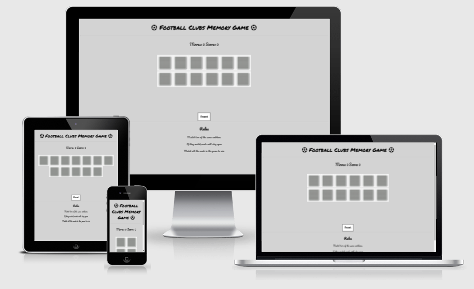
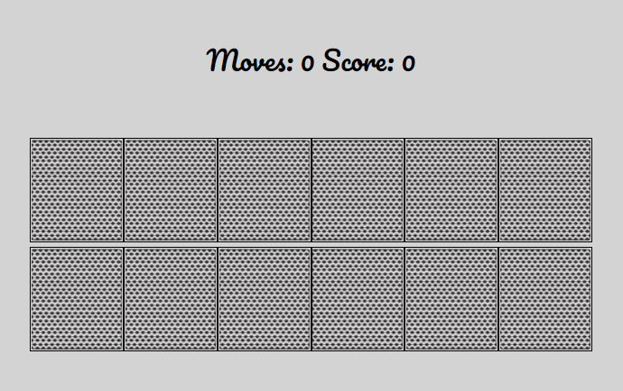

# Football clubs memory game

# Project goals
### Website owner goals
* I want users to be able to play fun and enjoyable game
* I want users returning to my site to play the game

### Features
* Header with the cleat stating what the game is
* Moves and Score counter which are working perfectly
* Playground with 12 cards on the table,of which 2 are same

* Reset Button which is working perfectly
* Game rules in the footer

# User Eperience
It is divided on three smaller sections,one for the first time users, one for the regular users and one for the owner.

### First-time users 

1. As a first-time user,I want to understand what the game goal is.
2. As a first-time user,I want to know the game rules.
3. As a first time user,I want to challenge my memory.
4. As a first-time user,I want to be able to navigate the page without long waiting time.
5. As a firt-time user,I want to see how long does it take me to complete the game.

### Regular visitor

6. As a regular user,I want to see my score.
7. As a regular user,I want to see how many moves I made.

### Site owner

8. As a site owner, I want users to be able navigate easy through the page and its features.
9. As a site owner,I want users to have fun and come back again.

## Features left to implement 

* I would like to make bigger game for the desktop,I have tried putting 20 cards on the table,but it was just too big and messy,especially for the mobile users as the icons were too small and it was too many of them.

## Testing

* I have tested the web app on three different browsers whhich inculde Chrome,Explorer and Firefox.
* I confirm that the result is always correct.
* I confirm that is easy to navigate the page and the rules are clearly stated.
* I confirm that the colors and fonts are easy to see and easy to read.

### Testing with Lighthouse

* I have tested my app for the mobile devices and desktop over the Lighthouse dev tool and those are my results.
* Mobile :

* Desktop :

## Bugs

### Solved bugs

* Had problems that all the cards were opening without match, I missused query selectors and id's 

* Moves and score table didn't react to gameplay,it was actually really simple and I found the answer on stackoverflow : 

function movesCounter () {
       movesCount.innerHTML ++;
       moves ++;

### Unsolved bugs

* I noticed on the end that I can press one card 2 times. It is not bad because the game counts as you played twice and just flips cards back, but maybe for future is something that is for to look up.

## Validator testing

1. HTML

* No errors were returned when I put my code through the official W3C validator.

2. CSS

* No errors were found when I put my code through the official (Jigsaw) validator.

3. JS

* No errors were found when I put my code through JS Hint, Javascript validator.

## Deployment

*